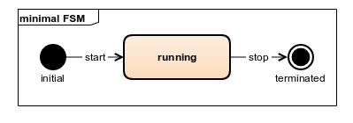

# Finite State Machine

`ecpp::fsm` is a finite state machine C++17 (C++20 in main branch) library designed for usage in single threaded environment.

## Inspiration and Motivation

The `ecpp::fsm` library was inspired by [`::afsm`](https://github.com/zmij/afsm ) library
and implemented in such a way that it would repeat the syntax of `::afsm` as closely as possible.
The `cpp::fsm` library is compiled by any compiler that supports C++20, while `::afsm` is not compiled by compilers
Microsoft Visual Studio and MinGW.

## Features

* Statechart features
  * Transition actions
  * Internal transitions
  * Transition guards (conditions)
* Compile-time checks
* Header only
* Relatively fast compile time
* No external dependencies

## Synopsis

Here is a UML diagram of a trivial state machine and source code that it is mapped to.



```c++
#include <cassert>
#include <fsm/fsm_ecpp.h>

using namespace ecpp::fsm;

// Events
struct start {};
struct stop {};

// State machine definition
struct minimal_def {
//@{
/** @name States */
struct initial      : state<initial> {};
struct running      : state<running> {};
struct terminated   : state<terminated> {};
//@}

using initial_state = initial;
using transitions   = transition_table
  <
    /*  State       Event       Next        */
    tr< initial,    start,      running     >,
    tr< running,    stop,       terminated  >
  >;
};

// State machine object
using minimal = ecpp::fsm::state_machine<minimal_def>;

void use()
{
    minimal fsm;
    assert(fsm.is_in_state<minimal_def::initial>());
    assert(fsm.process_event(start{}) == event_result::done);
    assert(fsm.is_in_state<minimal_def::running>());
    assert(fsm.process_event(stop{})  == event_result::done);
    assert(fsm.is_in_state<minimal_def::terminated>());
}
```

## License

[MIT License](LICENSE)
